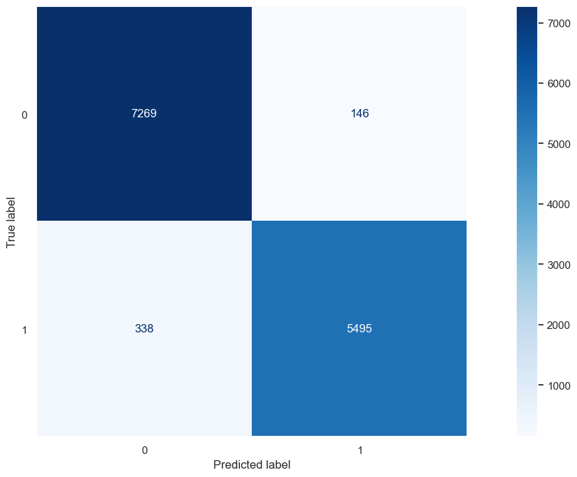
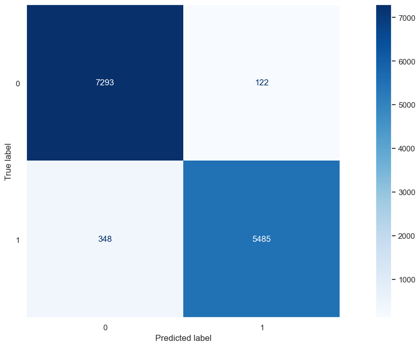

# InStyle Net Promoter Score

**Disclaimer**: InStore Net Promoted Score is a Binary Classification project, based on this [Kaggle Competition](https://www.kaggle.com/competitions/instyle-nps). The context, company and business problem are ficticial.

# 1. BUSINESS SCENARIO

## 1.1 - InStyle and their Business Problem

 InStyle is one of the largest clothing stores in the United States facing customer experience issues.

The major challenge in scaling a store's revenue is to maintain product quality and high customer satisfaction rates.

As the company reaches more customers, internal sales processes starting from product conception, going through marketing promotion, and reaching financial payment systems begin to encounter issues.

The product team struggles to determine the majority of customers' needs. The marketing team faces challenges in identifying the ideal customer, and the development team grapples with high volumes of website and app traffic, leading to system crashes and rendering the site inoperable for hours. This, in turn, generates numerous complaints in customer service, led by the customer experience team.

Therefore, measuring customer satisfaction is extremely important for the company to maintain a good reputation in the market.

An interdisciplinary team called the "War Room," composed of professionals from Product, Marketing, Design, Data, and Development, was assembled to ensure an excellent customer shopping experience and a high satisfaction rate, even with the rapid growth in sales volume.

One of the War Room's first emergency actions was to provide personal assistance to customers. However, the initial challenge was to identify which customers had a "Satisfied" or "Neutral/Unsatisfied" satisfaction level, so the team could contact only the "Neutral/Unsatisfied" customers.

The Data Scientists of the War Room were tasked with training an algorithm to classify customers from a spreadsheet as "Satisfied" or "Neutral/Unsatisfied," predicting which customers might become Unsatisfied and, therefore, taking swift action to understand the reason for dissatisfaction and reverse the customer's situation. 

# 2. SOLUTION STRATEGY

 The solution follows the CRISP-DM (Cross-Industry Standard Process for Data Mining), which is a cyclic method of development. At the end of the first cycle, the team will have a first version end-to-end of this solution, allowing them to achieve good results faster, identify and address potential problems effectively. 

### **Business Problem and Business Understanding:** 

 It is essential to fully understand the business problem being addressed. This involves engaging in conversations with stakeholders to gain a clear insight into the challenges and goals. Establish measurable objectives. Ensure that the proposed solution is aligned with the broader goals of the organization. Identify the target audience of the solution and understand their needs and expectations. This includes assessing the technical feasibility of the proposed solution. Ensure that all relevant information about the business problem is documented clearly and accessible to the entire team involved in the project. Maintain open and ongoing communication with stakeholders throughout the process. 

### **Data Extraction and Data Cleaning:**

Collecting, uploading, accessing the data to be used to solve the business questions. And runing an initial check on the datas to identify:

* Number of Rows
* Number of Columns
* Data Types
* NaN Values
* Statistic Analysis (Central tendency, dispersion, etc.) 

### **Exploratory Data Analysis:** 

On this phase tree types of analysis are made:

* **Univariate Analysis:** To understand the distribution of each feature, if there are outliers, if it is a normal distribution, etc.
* **Bivariate Analysis:** Where some business hyphotesis are made and validate
* **Multivariate Analysis:** Correlation analysis among all features.

### **Data Modeling and Feature Engineering:**

Feature engineering consists in derivate/modify (new) features from the existing ones, aiming to find something that can help to better explain the phenomenon of study.

Modeling consists in work with the datas aiming to adjust them according the machine learning principles. Below, are some exemples about what are done in this phase:

* Handling with missing values (NaN): fill, remove, filter, etc.
* Encoding: change from categorical to numerical
* Scaling and Normalization: ensure the numerical variables are on a similar scale.
* Dimensionality Reduction: Applying techniques like Principal Component Analysis (PCA) to reduce the number of features while preserving as much information as possible.
* Feature Engineering: Iteratively selecting and refining features based on their importance or relevance to the problem.

### **Machine Learning Modelling:**

Model Selection: Choose appropriate machine learning algorithms based on the nature of the problem and data.
Training and Evaluation: Train models on the training set and evaluate their performance using the testing set.
Hyperparameter Tuning: Fine-tune model hyperparameters to optimize performance. This involves adjusting parameters that are not learned from the training data, such as learning rates or regularization terms.

### **Evaluation**

The evaluation phase involves analyzing the performance of the machine learning model to determine whether it meets the established criteria and is satisfactory for further advancement in the project. During this step, the chosen performance metrics are compared with the actual process or results.

### **Deployment** 

Publish the model in a cloud environment so that other people or services can use the results to improve and make business decisions.

# 3. Hypothesis and Insights

**1 - As the dressing room score increases, the volume of dissatisfied customers decreases.**

**2. As the toilet cleaning score increases, the volume of dissatisfied customers decreases.**

**3. Male customers are generally more satisfied than female customers.**

**4. The larger the store, the more satisfied its customers tend to be.**

**5. Even unsatisfied customers are happy with the store service.**

# 4. Data Modelling

 In this phase, we worked on feature engineering, encoding, and rescaling techniques.

On feature engineering, we created two new features:
* **distance:** Classify as 'close' those instances where the 'store_distance' value is lower than 2500, and as 'far' those instances where the 'store_distance' value is higher.
* **age group :** Assign the label "young" if the age is lower than 18, "adult" if it is higher than or equal to 18 and lower than 60, and "elderly" if the age is 60 or higher.

On encoding and rescaling, we worked with:

* **frequency encoding:** Change categorical values to numerical values based on their frequency of occurrence.
* **ordinal encoding:** Change categorical values to numerical values, taking into consideration the importance of each value.
* **Min Max Scaler:** Rescaling the numerical features is applied to features that do not follow a normal distribution.
* **Robust Scaler:** Rescaling the numerical features is applied to features that follow a normal distribution and contain outliers.

# 5. Machine Learning Models

**The aim of the project is to identify Neutral or Dissatisfied Customers**
On this step, I will use the datasets as per below:
- X, y: to train and evaluate the machine learning models using cross validation technique;
- train_x, train_y: to train the machine learning models;
- val_x, val_y: to evaluate the trained machine learning models;
- test_x, test_y: to evaluate the machine learning model, after hyperparameteres fine tuning;

The algorithms will be evaluated calculating the micro-precision metric;
- Precision micro: represents the ratio of correct classifications for a positive class in relation to the total positive instances that the algorithm predicted.

I have started with some models and the performance of them, without fine tuning, can be seem below:

The performance for the machine learning are as per below:

| ML Model                | Precision_micro cross_validation|Precision_micro Train, Val, Test Split |
|:------------------------|:--------------------------------|---------------------------------------|
| XGB                     | 0.9643                          |0.9627                                 |
| LGBM                    | 0.9651                          |0.9634                                 |
| Logistic Regression     | 0.5666                          |0.5696                                 |
| Randon Forest           | 0.9643                          |0.9630                                 |

The algoriths XGB, LGBM and Randon Forest have a similar performance, so I decided to further advance with LGBM and XGB because they are lighter and quicker to evaluate in relation to the Randon Forest.

I have fine tuned the selected models and the performance could be checked at the table below:

| ML Model                | Precision_micro cross_validation|Precision_micro Train, Val, Test Split |
|:------------------------|:--------------------------------|---------------------------------------|
| XGB                     | 0.9649                          |0.9634                                 |
| LGBM                    | 0.9651                          |0.9645                                 |

The difference when comparing the chosen metric isn't significant. However, when comparing the predictions using the confusion matrix, there is a slightly noticeable difference. As the LGBM has shown better performance, I have decided to continue the project with this algorithm.

Just for better understanding, the dataset used to evaluate the models contains 13,248 records, with 7,415 dissatisfied customers and 5,833 satisfied customers. The LGBM was able to identify 7,293 dissatisfied customers, making 122 incorrect predictions, while XGB was able to identify 7,269, making 146 incorrect predictions.

|  |  |
|:--:|:--:|
| **Figura 1:** XGB Confusion Matrix. | **Figura 2:** LGBM Confusion Matrix. |

I consider this a great result for the project, and it will certainly help to improve the satisfaction level of In Style customers.

# 6. Technologies

## Please refer to the complete project to follow the step-by-step process and my reasoning behind its development. You will find the Jupyter notebook within the 'notebook' folder.

# AUTHOR
### Ricardo Perottoni

