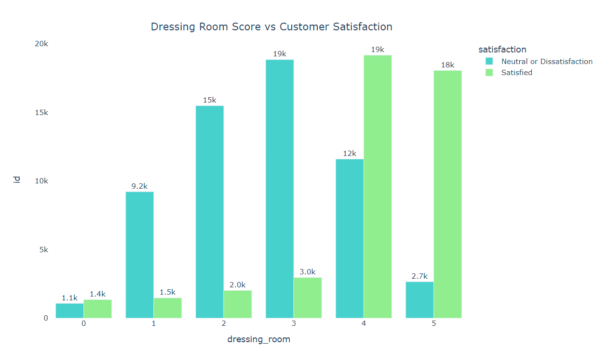
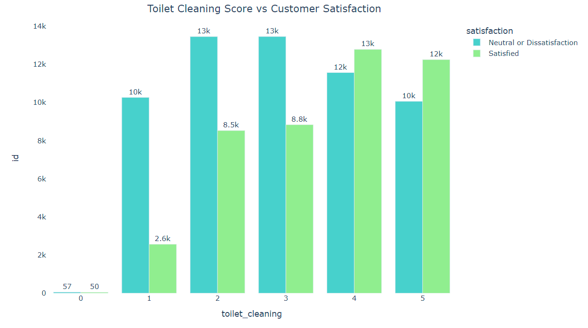
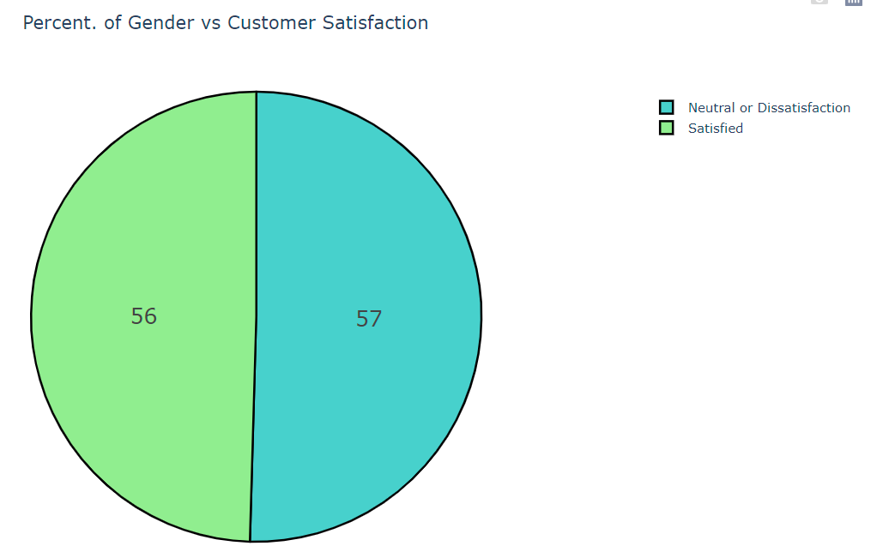
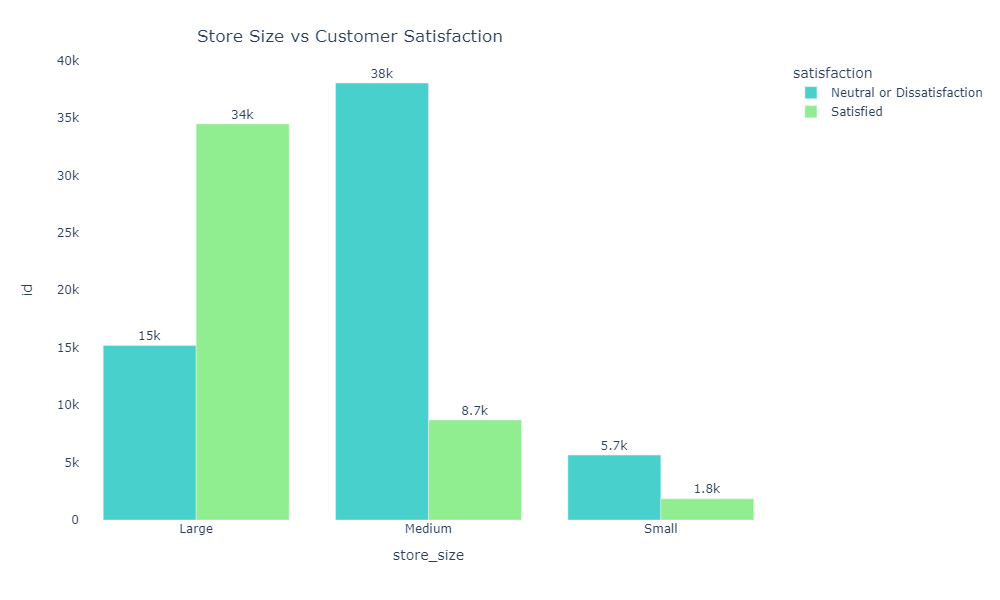
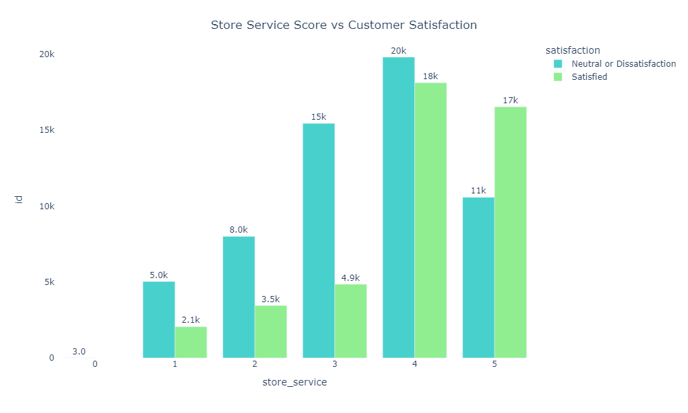

# InStyle Net Promoter Score

**Disclaimer**: InStore Net Promoted Score is a Binary Classification project, based on this [Kaggle Competition](https://www.kaggle.com/competitions/instyle-nps). The context, company and business problem are ficticial.

# Table of Contents

* [1. Business Scenario](#1-business-scenario)
* [2. Solution Strategy](#2-solution-strategy)
* [3. Data Filtering](#3-data-filtering)
* [4. Hypothesis and Insights](#4-hyphotesis-and-insights)
* [5. Machine Learning Models](#5-machine-learning-models)
* [6. Machine Learning Performance](#6-machine-learning-performance)
* [7. Business Results](#7-business-results)
* [8. Next Steps](#8-next-steps)
* [9. Technologies](#9-technologies)

# 1. Business Scenario

## 1.1 - InStyle and their Business Problem

 InStyle is one of the largest clothing stores in the United States facing customer experience issues.

The major challenge in scaling a store's revenue is to maintain product quality and high customer satisfaction rates.

As the company reaches more customers, internal sales processes starting from product conception, going through marketing promotion, and reaching financial payment systems begin to encounter issues.

The product team struggles to determine the majority of customers' needs. The marketing team faces challenges in identifying the ideal customer, and the development team grapples with high volumes of website and app traffic, leading to system crashes and rendering the site inoperable for hours. This, in turn, generates numerous complaints in customer service, led by the customer experience team.

Therefore, measuring customer satisfaction is extremely important for the company to maintain a good reputation in the market.

An interdisciplinary team called the "War Room," composed of professionals from Product, Marketing, Design, Data, and Development, was assembled to ensure an excellent customer shopping experience and a high satisfaction rate, even with the rapid growth in sales volume.

One of the War Room's first emergency actions was to provide personal assistance to customers. However, the initial challenge was to identify which customers had a "Satisfied" or "Neutral/Unsatisfied" satisfaction level, so the team could contact only the "Neutral/Unsatisfied" customers.

The Data Scientists of the War Room were tasked with training an algorithm to classify customers from a spreadsheet as "Satisfied" or "Neutral/Unsatisfied," predicting which customers might become Unsatisfied and, therefore, taking swift action to understand the reason for dissatisfaction and reverse the customer's situation. 

# 2. Solution Strategy

 The solution follows the CRISP-DM (Cross-Industry Standard Process for Data Mining), which is a cyclic method of development. At the end of the first cycle, the team will have a first version end-to-end of this solution, allowing them to achieve good results faster, identify and address potential problems effectively. 

**Business Problem and Business Understanding:** 

 É essencial compreender completamente o problema de negócio que está sendo abordado. Isso envolve conversas com as partes interessadas para obter uma visão clara dos desafios e das metas.
Estabelecer objetivos de forma mensurável. 
Certificar-se de que a solução proposta está alinhada com os objetivos mais amplos da organização. 
Identificar o público-alvo da solução e entender suas necessidades e expectativas. Isso inclui 
Avaliar a viabilidade técnica da solução proposta. 
Garantir que todas as informações relevantes sobre o problema de negócio estejam documentadas de forma clara e acessível a toda a equipe envolvida no projeto.
Manter uma comunicação aberta e contínua com as partes interessadas ao longo do processo. 

### **1. Data Extraction and Data Cleaning:**

Collecting, uploading, accessing the data to be used to solve the business questions. And runing an initial check on the datas to identify:

* Number of Rows
* Number of Columns
* Data Types
* NaN Values
* Statistic Analysis (Central tendency, dispersion, etc.) 

### **2. Exploratory Data Analysis:** 

On this phase tree types of analysis are made:

* **Univariate Analysis:** To understand the distribution of each feature, if there are outliers, if it is a normal distribution, etc.
* **Bivariate Analysis:** Where some business hyphotesis are made and validate
* **Multivariate Analysis:** Correlation analysis among all features.

### **3. Data Modeling and Feature Engineering:**

Feature engineering consists in derivate/modify (new) features from the existing ones, aiming to find something that can help to better explain the phenomenon of study.

Modeling consists in work with the datas aiming to adjust them according the machine learning principles. Below, are some exemples about what are done in this phase:

* Handling with missing values (NaN): fill, remove, filter, etc.
* Encoding: change from categorical to numerical
* Scaling and Normalization: ensure the numerical variables are on a similar scale.
* Dimensionality Reduction: Applying techniques like Principal Component Analysis (PCA) to reduce the number of features while preserving as much information as possible.
* Feature Engineering: Iteratively selecting and refining features based on their importance or relevance to the problem.

### **4. Machine Learning Modelling:**

Model Selection: Choose appropriate machine learning algorithms based on the nature of the problem and data.
Training and Evaluation: Train models on the training set and evaluate their performance using the testing set.
Hyperparameter Tuning: Fine-tune model hyperparameters to optimize performance. This involves adjusting parameters that are not learned from the training data, such as learning rates or regularization terms.

### **5. Evaluation**

The evaluation phase involves analyzing the performance of the machine learning model to determine whether it meets the established criteria and is satisfactory for further advancement in the project. During this step, the chosen performance metrics are compared with the actual process or results.

### **6. Deployment** 
Publish the model in a cloud environment so that other people or services can use the results to improve the business decision.

# 4. Hypothesis and Insights

**1 - As the dressing room score increases, the volume of dissatisfied customers decreases.**

**2. As the toilet cleaning score increases, the volume of dissatisfied customers decreases.**

**3. Male customers are generally more satisfied than female customers.**

**4. The larger the store, the more satisfied its customers tend to be.**

**5. Even unsatisfied customers are happy with the store service.**

# 5. Data Modelling

 In this phase, we worked on feature engineering, encoding, and rescaling techniques.

On feature engineering, we created two new features:
* **distance:** Classify as 'close' those instances where the 'store_distance' value is lower than 2500, and as 'far' those instances where the 'store_distance' value is higher.
* **age group :** Assign the label "young" if the age is lower than 18, "adult" if it is higher than or equal to 18 and lower than 60, and "elderly" if the age is 60 or higher.

On encoding and rescaling, we worked with:

* **frequency encoding:** Change categorical values to numerical values based on their frequency of occurrence.
* **ordinal encoding:** Change categorical values to numerical values, taking into consideration the importance of each value.
* **Min Max Scaler:** Rescaling the numerical features is applied to features that do not follow a normal distribution.
* **Robust Scaler:** Rescaling the numerical features is applied to features that follow a normal distribution and contain outliers.

# 6. Machine Learning Models
On this step, as we are working on a binary classification problem, we selected two boosting algorithms for classification. They are:

XGBoost Classifier (Extreme Boosting Classifier) and LGBM Classifier ( Light Gradient Boosting Classifier). The way that they work are very similar and both are powerful and light machine learning algorithms to be deployed to production.

The metric selected for this business problem is a precision_micro, which is a variation of the precision metric.This metric is suitable for situations where you want to evaluate the overall model performance without considering specific classes.

Before to start with the algorithms, tree new datasets were created from the initial one:

* **train:** Containing aroun 80% of the total data and it will be used to train the algorithm.
* **validation:** Containing around 10% of the total data and it will be used to select the best parameters (fine tuning)
* **test:** Containing around 10% of the total data and it will be used to evaluate the selected model after tuning.

The steps to evaluate the machine learning algorithms are:
* Model Definition
* Model Trainind
* Model Prediction
* Evaluation

The performance for both algorithms trained on train dataset is described below:

| ML Model                | Precision_micro         
|:------------------------|:------------------------
| LGBM                    | 0.9638   
| XGB                     | 0.9646

From these options, LGBM was selected for use in production due to its superior performance and faster execution compared to XGBoost. So, a Bayesian search technique was used for hyperparameter tuning, and the algorithm performance after fine tuning can be checked below:

| ML Model                | Precision_micro_      
|:------------------------|:------------------------
| LGBM                    | 0.9678     

## 7.2 - Business Problem Solution

# 9. Technologies

# AUTHOR
Ricardo Perottoni

###### All Rights Reserved - Comunidade DS 2022
